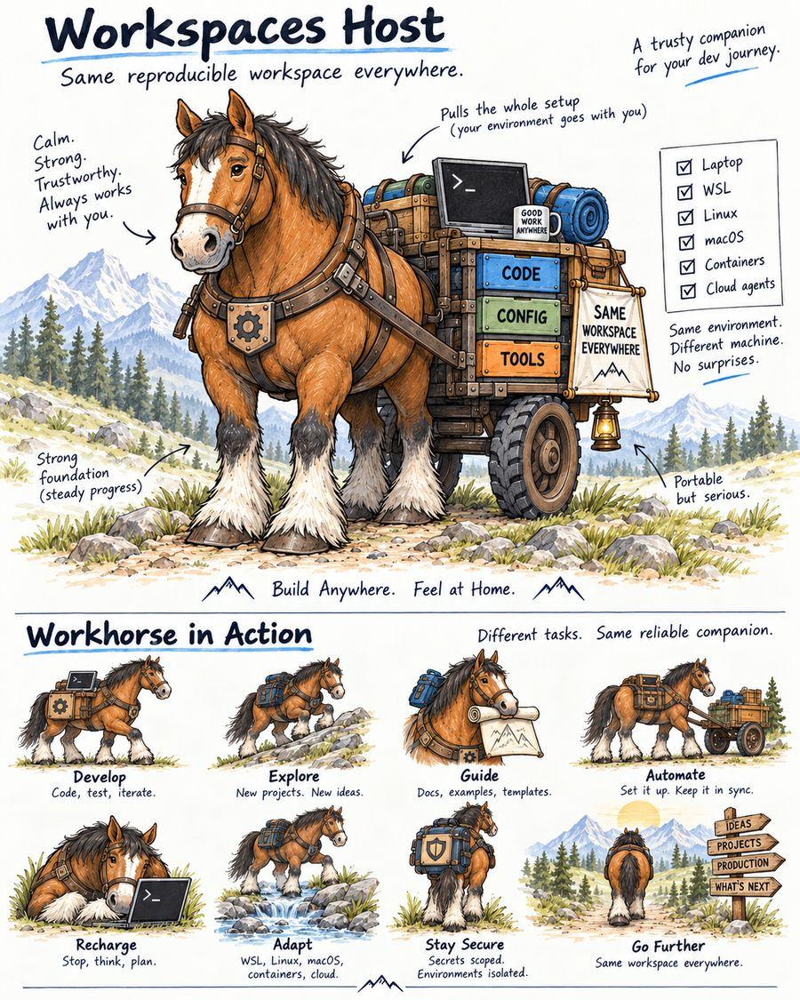

# workspaces-host-v3

I built this so you get one working engineering setup, everywhere: a configured bash shell, git
and GitHub/GitLab credentials handled safely, a way to keep every git repo you touch in one
predictable place, and a growing set of everyday developer tools. Same setup on Windows (via
WSL), Linux, a Mac, inside a container, or in a cloud AI-agent session. One command gets you
there.

It runs on Nix flakes and home-manager. The whole environment is code, not a list of manual steps
someone forgot to update. Pull a commit, rebuild, and you get the exact same result every time. A
small set of "personas" add extra tools on top for backend, data, mobile, agent-ops, compliance,
and networking work, so the base install stays small and everyone gets only what they actually
need.

## Full documentation

**[intellectual-frontiers.github.io/workspaces-host-v3](https://intellectual-frontiers.github.io/workspaces-host-v3/)**
has everything: installation for Windows (WSL), Linux, and macOS; day-to-day usage; the technical
architecture; and the reasoning behind every real design decision. That site is the comprehensive,
always-current documentation. This README stays short on purpose (the site's own
[Why the docs live here, not in the README](https://intellectual-frontiers.github.io/workspaces-host-v3/#why-docs-architecture)
explains why).

## For contributors

The principles behind every design choice live in
[`.specify/memory/constitution.md`](.specify/memory/constitution.md); the requirements each
feature implements live in [`specs/`](specs/). This repo follows
[GitHub Spec Kit](https://github.com/github/spec-kit)'s spec-driven workflow: every feature gets a
spec, a plan, and, once built, code, under `specs/<NNN-name>/`. Run `nix flake check` before
sending a change. A spec that no longer matches the code is worse than no spec at all; fix that in
the same change that causes the mismatch, not as a cleanup pass that may never happen.

Prose documentation (this README, the docs site, a spec's own narrative sections) follows
[`.specify/memory/writing-style.md`](.specify/memory/writing-style.md). A spec's Functional
Requirements, Acceptance Scenarios, and Success Criteria stay in SpecKit's own precise, testable
requirement language instead. See the constitution's "Documentation Voice" principle.
