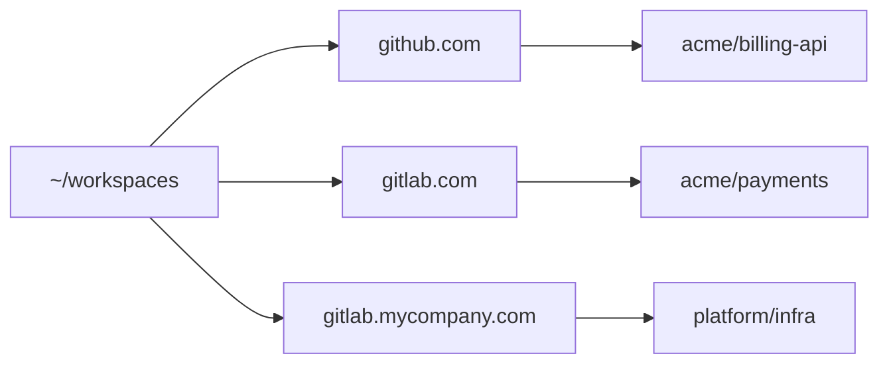

`ws-repos` keeps every project you work on under one predictable layout, across as many git hosts as you actually use, not just one. (Wondering about the name? See [Why `ws-repos`](#faq/faq/why-ws-repos).)

## The basics

```
$ nano ~/workspaces/ws-repos.json   # { "repos": [{ "repo": "github.com/org/repo" }] }
$ ws-repos ensure                    # clone-or-pull everything listed
$ ws-repos status                    # up to date/needs a pull/dirty/untracked/locked/stash
$ ws-repos inspect                   # list git hosts and repos referenced by workspace files
```

Every repo lands at `~/workspaces/<git-host>/<org>/<repo>`, the same path segments as its HTTPS clone URL, so it stays predictable and greppable no matter how many hosts you work across.



> [!NOTE]
> On WSL: keep repos under `~/workspaces`, not `/mnt/c/Users/...`. Crossing the Windows/Linux filesystem boundary is slow, git especially. `doctor` checks for this too.

## Working across multiple hosts at once

`ws-repos.json` isn't limited to one host - list `github.com`, `gitlab.com`, and any self-hosted instance side by side, and `ws-repos ensure` clones from all of them the same way, one command:

```json
{
  "repos": [
    { "repo": "github.com/acme/billing-api" },
    { "repo": "gitlab.com/acme/payments" },
    { "repo": "gitlab.mycompany.com/platform/infra" }
  ]
}
```

Each one needs its own one-time authentication (see [Authenticate & manage credentials](#day-to-day/credentials/gh-glab-auth) for the `--hostname` form self-hosted GitLab needs), but after that, `ws-repos ensure`/`ws-repos status` treat every host identically - there's no per-host flag or mode to remember.

## Re-cloning a repo instead of pulling it

Add `"fresh": true` to one entry to delete and re-clone it instead of pulling - useful when a repo's history was rewritten upstream and a plain pull would conflict:

```json
{ "repo": "github.com/acme/billing-api", "fresh": true }
```

Remove the flag (or the whole entry) once you've re-cloned; it isn't meant to stay set permanently.

## Reading `status` across many repos at once

`ws-repos status` reports, per repo, in one pass: dirty (uncommitted changes), untracked files, ahead/behind your upstream, a stuck `index.lock` ("locked"), and stash count. It fetches from each repo's upstream first, so "needs a pull" reflects the real remote instead of the last time anything happened to fetch it - this makes `status` a network operation, unlike `ensure`/`inspect`, which stay local-only once a repo is cloned. Each repo prints with a colored icon (auto-disabled for a non-terminal, over `NO_COLOR=1`, or under `TERM=dumb`) and a path relative to wherever you ran the command from, plus a closing tally of how many repos are up to date, need a pull, or need attention. Run it before a sync-heavy day to see, at a glance, which of the repos you're tracking actually need attention before you touch any of them.

## `*.mgit.code-workspace` files

`ws-repos inspect` reads any `*.mgit.code-workspace` file in `~/workspaces` and lists every git host and repo it references - useful for auditing a multi-root VS Code workspace someone else set up, or for confirming a workspace file matches what `ws-repos.json` actually tracks. (The `.mgit` suffix is a deliberate compatibility choice, not a typo - see [Why `ws-repos`](#faq/faq/why-ws-repos).)

## Try with AI

You want a new repo added without hand-editing JSON.

```
Add github.com/<org>/<repo> to my ws-repos.json in ~/workspaces, then run ws-repos ensure to clone it.
```
