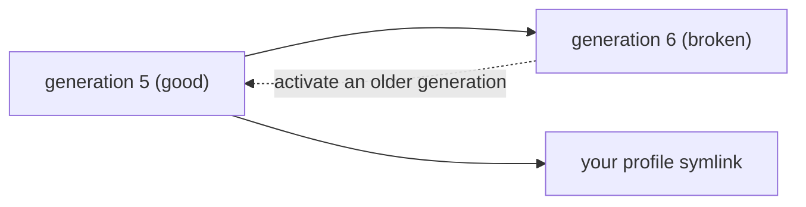

## Checking your environment {#checking-your-environment}

```
$ doctor
```

By default you get the essentials: Nix, your shell, git, credentials, GitHub/GitLab authentication, and `ws-repos`, plus a one-line summary. Run `doctor --all` for everything else: every ported tool, and every persona-specific check reported as an informational `WARN` when that persona isn't active. A real `FAIL` always prints, in either mode.

## Keeping in sync

New features land on `main` as small, merged changes. Your machine doesn't pick those up on its own:

```
$ cd ~/.workspaces-host-v3
$ workspaces-host-update
```

Every shell also checks once a day, in the background, whether `origin/main` has moved, and nudges you if so. It never runs the update itself.

## Recovering from a bad update

If an update ever breaks something, roll back with home-manager's own generations. No separate tooling needed:

```
$ home-manager generations
2026-09-13 14:02 : id 6 -> /nix/store/i9k2x...-home-manager-generation   # the broken one
2026-09-13 09:47 : id 5 -> /nix/store/7fa31...-home-manager-generation   # the one before it
$ /nix/store/7fa31...-home-manager-generation/activate
```

Every `home-manager switch` (what `workspaces-host-update` runs under the hood) creates a new, numbered generation rather than editing anything in place - nothing is lost, so rolling back is always just pointing your profile symlink at an older one. There's no limit on how far back you can go as long as the old generation's Nix store paths haven't been garbage-collected.



## Try with AI

An update made things worse, and you want the previous state back.

```
My last workspaces-host-update broke something. List my home-manager generations, tell me which one was the last good one, and roll back to it.
```

Or, if you don't know which command tells you why something looks wrong in the first place:

```
Run doctor --all in my sandbox, explain any FAIL or WARN lines in plain language, and tell me exactly what to do to fix each one.
```
