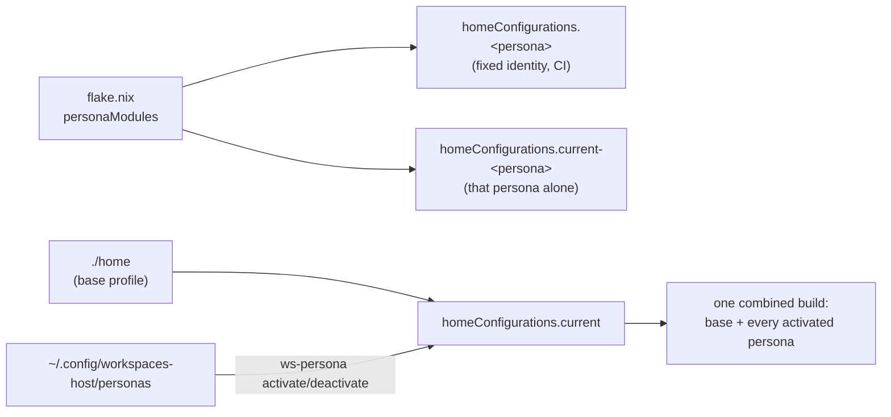

## Nix, in plain terms

I run this whole environment on **Nix**, a package manager that installs exact, pinned versions of every tool, bash and git included, into its own store, keyed by a hash of everything that went into building it. Two machines that build the same input get byte-identical output. That's the whole guarantee this repository exists to give you: no "works on my machine," because there's only one machine's worth of software here, reproduced everywhere.

A **flake** is Nix's own unit of "here's a reproducible thing, pinned." `flake.nix` at the repository root declares the inputs (nixpkgs, home-manager, both pinned by commit in `flake.lock`) and the outputs: home-manager configurations, packages, and checks.

**home-manager** takes a Nix module describing your user environment (packages, dotfiles, shell config) and applies it declaratively to your account. Every time it runs, it builds a new **generation**, a complete, numbered snapshot, and switches your profile symlink to point at it. Nothing gets edited in place, which is why rolling back is just pointing that symlink at an older generation (see [Stay in sync & recover](#day-to-day/sync-recover)).

> [!NOTE]
> Two identities matter in this flake: `default` is a fixed test identity (`home.username = "workspace"`) used by `nix flake check` and CI, evaluated *purely*, no reading the real environment. `current` reads your actual `$USER`/`$HOME` via `builtins.getEnv`, which needs `--impure`. Every real install uses `current`; every persona also has a `current-<persona>` counterpart.

## Repository layout

```
flake.nix                # inputs, systems, homeConfigurations, packages, checks
home/
  default.nix             # the base profile's module list
  shell.nix               # bash, oh-my-posh, zoxide, fzf
  git.nix                 # git identity + delta + aliases
  tools.nix                # pinned everyday CLI tools
  ai-harness.nix            # per-invocation credential wrappers for AI CLIs
  workspaces.nix             # ~/workspaces + ws-repos.json bootstrap
  secrets.nix                # opt-in sops-based secrets
  profiles/
    backend.nix               # persona: Java/Postgres/Redis/docker-compose
    data.nix                   # persona: python3/uv/duckdb
    mobile.nix                  # persona: android-tools/watchman
    agent-ops.nix                 # persona: act/semtag/git-standup/gopass/deno/llm
    compliance.nix                 # persona: osquery/cnquery/steampipe/openobserve/surveilr
    networking.nix                  # persona: tailscale/nebula
    fish.nix                         # persona: fish shell
docs/                          # this site: index.html (shell) + content/*.md + vendor/marked.js
pkgs/                          # this repo's own custom-built tools (ws-repos, doctor, ...)
oci/                          # container image definitions, same closure as the host
specs/<NNN-name>/               # one spec.md + plan.md per feature
.specify/memory/
  constitution.md                # the non-negotiable principles
  writing-style.md                 # the prose voice every doc follows
```

## How personas work

Every persona is a small home-manager module under `home/profiles/` that adds its own `home.packages` (and sometimes imports a shared module the base profile doesn't, like `backend` importing `home/java.nix`). `flake.nix` maps each entry in `personaModules` to a `homeConfigurations.<persona>` (fixed test identity, for CI) and a `homeConfigurations.current-<persona>` (real identity, that one persona only, ignoring anything activated) - both built from the same base `home/` module set plus that one extra module. Personas are purely additive: nothing a persona module does can remove or override what the base profile already configures, which is exactly what lets several of them stack safely in one build.

`homeConfigurations.current` is where that stacking actually happens: it reads `~/.config/workspaces-host/personas` (one name per line, `#` comments allowed, an unrecognized name dropped with a `builtins.trace` warning rather than failing the whole build) and folds every named persona's module into the same build alongside `./home` - `ws-persona activate`/`deactivate` just add or remove a line in that file, nothing more; they never run `nix build` or `home-manager switch` themselves. Since this state lives outside the repository and is only read impurely, it's invisible to `nix flake check`'s pure evaluation, same as `local.nix`.



See [Add a tool or write a new persona](#going-further/add-a-tool-or-persona) for a concrete walkthrough of writing one.

## How this documentation site itself works

This page you're reading is fetched, not baked in: `docs/index.html` is a thin shell (nav, CSS, a small router), and every page's content is a plain Markdown file under `docs/content/<tier>/<page>.md`, fetched and rendered at navigation time by [marked](https://github.com/markedjs/marked), vendored into `docs/vendor/marked.js` rather than loaded from a live CDN. A second vendored library, [Mermaid](https://mermaid.js.org/), renders the diagrams on pages like this one, loaded lazily only when a page actually has one. Neither is pulled from a live CDN, so the site has no third-party dependency at request time. The sidebar's "On this page" list is generated from each page's actual rendered headings, not hand-maintained, so it can't drift out of sync with a heading edit the way the old single-HTML version could.
