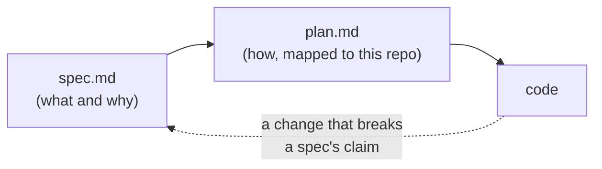

This repository is built to be handed to an agent, and mostly has been: large parts of it were. Point Claude Code, Codex, or another agent at a checkout and it already has everything it needs to work correctly, as long as it actually reads what's here first.

## The constitution

[`.specify/memory/constitution.md`](https://github.com/intellectual-frontiers/workspaces-host-v3/blob/main/.specify/memory/constitution.md) is the actual governance document, and it supersedes every other practice in this repository. Six principles, worth knowing before you change anything:

1. **Reproducible by lockfile, not by drift.** Nothing gets installed imperatively; if it can't be declared in the flake, it doesn't belong here yet.
2. **Ephemeral and disposable by default.** Rebuild, don't patch. No feature can depend on state surviving a wipe.
3. **Secrets never touch the agent's shell unscoped.** Every credential is resolved at the point of use, never as an ambient shell variable. Non-negotiable, since this repository explicitly provisions environments AI agents run inside.
4. **Container and cloud-harness parity is required, not optional.** A feature that only works on a persistent host is incomplete.
5. **Simplicity over completeness.** Build to what the spec needs today. A prior version's tool or workaround needs its own justification, not "that's how it was done before."
6. **Documentation voice.** Prose documentation (this site, the README, a spec's own narrative sections) follows [`writing-style.md`](https://github.com/intellectual-frontiers/workspaces-host-v3/blob/main/.specify/memory/writing-style.md). A spec's testable requirements stay in SpecKit's own precise language instead.

## The spec-driven workflow

Every feature in this repository follows [GitHub Spec Kit](https://github.com/github/spec-kit)'s lifecycle: a spec (what and why, in testable requirements), a plan (how, mapped onto this repository's actual files), and only then code. `specs/<NNN-name>/spec.md` and `plan.md` exist for every feature, core and backlog alike. A spec that no longer matches the code is worse than no spec at all. A change that breaks a spec's claim updates that spec in the same commit, not as a followup that may never happen.

Specs are tiered: **core** (001&ndash;005) is the minimum that has to exist for the "same environment everywhere" promise to hold at all; everything else is **backlog**, specified in full but only implemented once actually scheduled. A backlog spec has to stand on its own: implementable without rewriting a core spec.

## Rules for an agent changing this repository

1. **Read the constitution before changing anything.** It's short, and it answers most "should this go here" questions before you have to ask them.
2. **Follow the spec-first lifecycle.** A real feature gets a spec and a plan before code. A bug fix or a small doc change doesn't need the full ceremony, but still needs the spec it touches updated in the same change if it makes that spec's claims wrong.
3. **Ask "does everyone need this, or only some engineers?"** before adding a package. The answer decides base profile vs. a persona - see [Add a tool or write a new persona](#going-further/add-a-tool-or-persona).
4. **Never export a secret to the ambient shell.** Every credential-consuming tool gets a per-invocation wrapper (`home/ai-harness.nix` has the pattern). This is Principle III, and it's the one principle this repository will not compromise on for convenience.
5. **Validate before claiming done.** `nix flake check --all-systems` at minimum; a real change to `home/` or a persona deserves an actual scratch-`$HOME` activation and a `doctor --all` run with zero unexpected `FAIL`s (see [Container & CI parity](#going-further/container-ci)). "The Nix expression evaluates" is not the same claim as "activation actually works."
6. **Write prose in this repository's voice.** [`writing-style.md`](https://github.com/intellectual-frontiers/workspaces-host-v3/blob/main/.specify/memory/writing-style.md) is specific and has a built-in audit pass; run it before calling documentation done.
7. **Keep this site current, not the README.** The README stays a short pointer; this site is the comprehensive, always-current documentation. A change that affects usage updates this site in the same commit, not the README (see [Why the docs live here, not in the README](#faq/faq/why-docs-architecture)).

`scaffold-agent-harness` (installed in every profile) drops a starter `AGENTS.md`, an `.mcp.json`, and a `.claude/settings.json` into any project, not just this one - the same idea, applied to whatever you're building next.

## Where to go deeper

- [The constitution](https://github.com/intellectual-frontiers/workspaces-host-v3/blob/main/.specify/memory/constitution.md): every non-negotiable principle, in full.
- [Every spec](https://github.com/intellectual-frontiers/workspaces-host-v3/tree/main/specs): the exact requirements behind every feature, core and backlog.
- [FAQ](#faq/faq): every design decision explained, and the earlier repositories this one grew out of.
